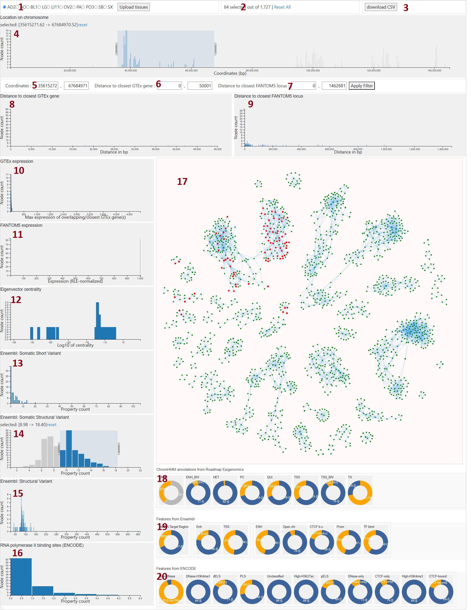

# BioClique visualization

An interactive chromatin interaction network visualization for exploring and studying different biological properties of densly interconnected regions. 

## Getting Started

Clone this repository locally and open the html file in a browser. Note: This project is tested on Chrome.
Then choose one of the preprocessed files when promted to select a dataset and chromosome. Finally choose one of the available tissue types and press the 'Upload tissue' button to start the visualization.

## Visualizations Explained

This visualization represents a Hi-C graph, which is a network made up of nodes and links. In this context, each node represents a chromatin segment, identified by its unique genomic coordinates. Chromatin segments are connected by links that reflect Hi-C interactions. Only nodes that form at least one clique of size 3 (C3) are visualized.

The properties of each node, such as specific biological characteristics or functions, are determined based on the node's genomic coordinates using information from various databases, such as ENCODE, Ensembl, Genotype tissue expression atlas, Roadmap Epigenomics.

The visualization includes multiple plots, each illustrating different aspects of the nodes based on their properties. Users can customize what they see by applying filters to these plots. This allows users to focus on nodes with properties that are of particular interest to them. Only nodes that meet the criteria set by all applied filters will be shown as active or highlighted in the visualization.

Following this introduction are detailed explanations for each plot included in the visualization, helping users understand what each plot shows and how to interpret it.

### BioClique Visualization Charts

| Nr. | Title             | Description                                                                                                                                                                                                                            |
|-------|------------|-------------------------------------------------------------------------------------------------------------------------------------------------------------------------------------------------------------------------------------------|
| 1 | Tissue selection  | For each chromosome, there are different tissue type graphs available. Each tissue has different set of chromatin interactions and gene expression values are different. Choose one tissue type to explore. |
| 2 | Filtered node count | The number of nodes (chromatin segments) that satisfy conditions of absolutely all filters that are currently applied are displayed here. |
| 3 | Download button | The downloaded file contains all available information about all segments that are currently active (satisfy all filters).|
|4, 5| Location on chromosome | Nodes have genomic coordinates (in base pairs). Use this plot to keep only those nodes that are located in a specific interval on the chromosome. It is possible to set the interval more precisely using (5).|
|6, 8| Distance to the closest GTEx gene | Genotype tissue expression (GTEx) atlas contains expression values of different genes in different tissue types. The distance between a GTEx gene and a node is measured in base pairs (bp). This distance is 0 if the node and gene segments overlap by at least 1 bp, indicating direct proximity. Otherwise, the distance is the shortest number of base pairs separating the two segments, reflecting the closest point between the node's and the gene's coordinates. In this plot, each node's distance to its one closest gene is shown. |
|7, 10| Distance to closest FANTOM5 | FANTOM5 expression values are taken from Forrest et al., A promoter-level mammalian expression atlas. Each node is assigned one closest FANTOM5 in the same manner as for GTEx genes in (6,8). The original data was available in hg19 genome coordinates, while the visualization uses GRCh38 coorinates, therefore all FANTOM5 locations were conversed to GRCh38 coordinates using Pyliftover.|
|10, 11| Expression value of the closest GTEx gene or FANTOM5 | For each node, the expression value of the nearest GTEx gene and FANTOM5 is displayed in two separate charts. If a node is equally close to multiple GTEx genes or FANTOM5 entities (distance=0 as calculated before in (8) and (9)), the highest expression value from among these is assigned to that node.|
|12| Eigenvector centrality | Base 10 logarithm of the eigenvector centrality metric for each node is shown in this chart. The value quantifies the 'influence' of a node in a graph.|
|13, 14, 15| Ensembl variants | The information on somatic short variants, somatic structural variants, and structural variants comes from the Ensembl database, which catalogs variants along with their genomic coordinates. A node is matched with a variant if they share an overlap of at least 20% of the length of the shorter entity. It is possible for one node to overlap with multiple variants and one variant to overlap with multiple nodes. The charts display the total count of variants that overlap with each node, indicating the number of variants associated with it.|
|16| RNA pol II b.s. | Information about RNA ploymerase II binding sites is taken from ENCODE. Following the methodology used in (13, 14, 15), each node is attributed a count of known binding sites from ENCODE. A binding site is assigned to a node if there is an overlap of at least 20%.|
|17| Network representation | All nodes and their Hi-C interactions are displayed in this network. Only links that form cliques of size 3 (C3) are visualized in this visualization and this network. All available information about a node is displayed on hover. All nodes that satisfy all current filters are highlighted. Additionally, it is possible to use the network as another filter by pressing shift button and selecting or deselecting a rectangle area to effectively filter one connected component or a part of it. Node shapes denote the following: Hexagons represent nodes overlapping with genes that are active in certain tissues and produce proteins; Squares indicate nodes overlapping with genes that, despite being cataloged, have no evidence of producing proteins; Circles are used for nodes not overlapping with any recognized genes. |
|18| ChromHMM annotations | ChromHMM annotations data is taken from Roadmap Epigenomics. There are many intervals on the chromosome with known ChromHMM annotations. A node is assigned a specific ChromHMM annotation if it overlaps with an annotated region by at least 20%. Use the pie charts to filter for nodes that either have a particular type of annotation assigned to them or not.|
|19| Features from Ensembl| Utilizing data from Ensembl, nodes are assigned properties based on their overlap with human miRNA target regions, regulatory features, and other regulatory regions. A property is assigned to a node if there is at least a 20% overlap between the node and any region of a specific type from Ensembl, measured against the shorter of the two intervals. If a node overlaps with one or more regions of a particular category, it is marked with that corresponding attribute. |
|20 | Features from ENCODE | Same as (19), but using data from ENCODE.|

## References

### Datasets

#### Preprocessed Hi-C Datasets
1. **Tissue pcHi-C** Jung, I., Schmitt, A., et al.: A compendium of promoter-centered long-range chromatin interactions in the human genome. Nature Genetics 51(10), 1442-1449 (2019). https://doi.org/10.1038/s41588-019-0494-8
2. **Tissue Hi-C** Kim, K., Jang, I., et al.: 3DIV update for 2021: a comprehensive resource of 3D genome and 3D cancer genome. Nucleic Acids Research 49(D1), D38-D46 (2021). https://doi.org/10.1093/nar/gkaa1078

#### Additional data used
1. **Ensembl** Fergal J Martin et al., Ensembl 2023, Nucleic Acids Research, Volume 51, https://doi.org/10.1093/nar/gkac958
2. **ENCODE** Luo Y et al., New developments on the Encyclopedia of DNA Elements (ENCODE) data portal. Nucleic Acids Res. 2020 Jan 8;48(D1):D882-D889. [doi: 10.1093/nar/gkz1062 .](https://doi.org/10.1093/nar/gkz1062)
3. **GTEx** Lonsdale, J. et al. The Genotype-Tissue Expression (GTEx) project. Nat Genet 45, 580–585 (2013). https://doi.org/10.1038/ng.2653.
4. **FANTOM5** The FANTOM Consortium and the RIKEN PMI and CLST (DGT). A promoter-level mammalian expression atlas. Nature 507, 462–470 (2014). https://doi.org/10.1038/nature13182.
5. **ChromHMM annotations from Roadmap Epigenomics** Roadmap Epigenomics Consortium., Kundaje, A. et al. Integrative analysis of 111 reference human epigenomes. Nature 518, 317–330 (2015). https://doi.org/10.1038/nature14248.

#### Tools

1. **DC.js**
   - **Description**: DC.js is a powerful JavaScript library that provides robust support for creating interactive data visualizations. It is used to implement cross-filter functionality.

2. **Pyliftover**
   - **Description**: Pyliftover is a Python package designed to facilitate the conversion of genomic coordinates between different human genome versions. For our purposes, we use Pyliftover to convert genomic coordinates from the hg19 to the GRCh38 reference genome.
   - **Link**: [Pyliftover on PyPI](https://pypi.org/project/pyliftover/)

3. **NetworkX**
   - **Description**: NetworkX is a Python library for the creation, manipulation, and study of the structure, dynamics, and functions of complex networks. Within our project, NetworkX is employed to calculate eigenvector centrality measures.

